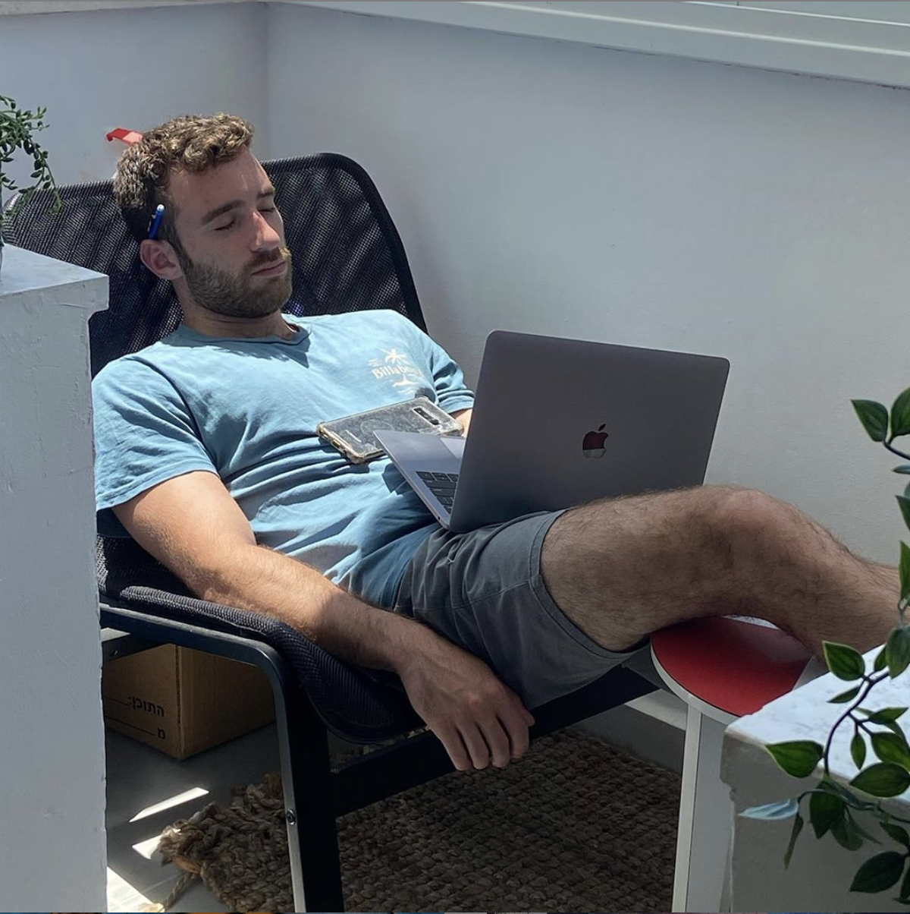

### Hi there 👋

Here are some ideas to get you started:

- 🔭 I’m currently working on several projects using ReactJS and some using the NextJS library. Also spending time using and teaching Ruby on Rails!
- 🌱 I’m currently learning better ReactJS practices, hoping to start working with TypeScript soon!
- 📫 How to reach me: Check out my portfolio! @ https://gevaxshabtay.com/ 
- 🐦 Also at -> [@gevaomer](twitter.com/gevaomer)
